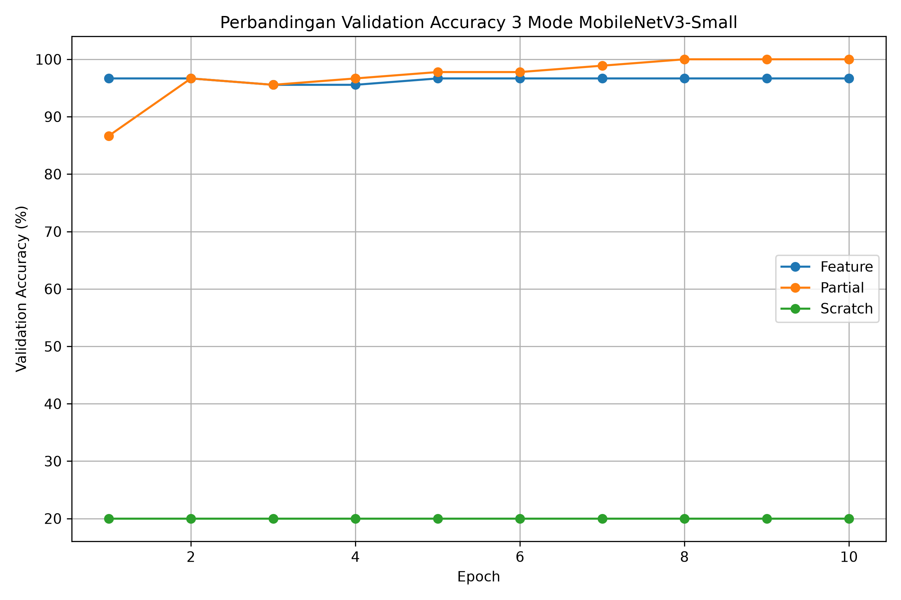
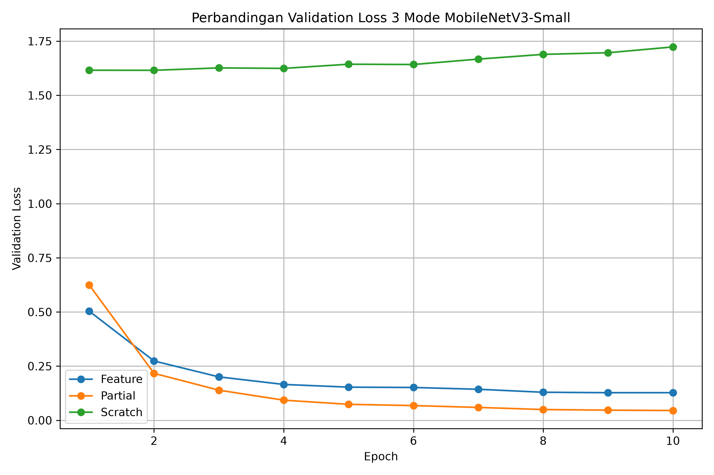
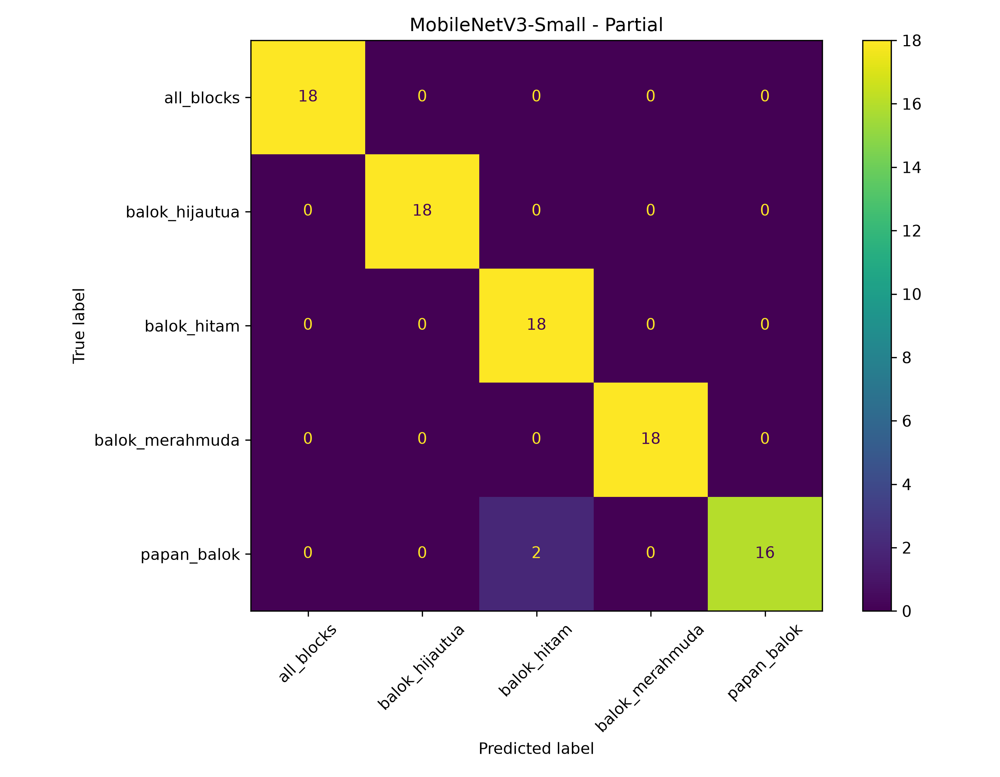

# MobileNetV3-Small Transfer Learning

Transfer Learning MobileNetV3-Small dengan 3 mode eksperimen: **Feature Extraction, Fine-Tuning Partial, dan Training from Scratch** untuk klasifikasi objek pada area pick and place robot UR3.

## 📊 Dataset

- **Total gambar:** 600
- **Jumlah kelas:** 5
- **Kelas:** `all_blocks`, `balok_hijautua`, `balok_hitam`, `balok_merahmuda`, `papan_balok`
- **Train:** 420 gambar
- **Validation:** 90 gambar
- **Test:** 90 gambar
- **Input model:** 224 × 224 pixel
- **Random seed:** 42

Dataset diperoleh secara mandiri menggunakan kamera pada area kerja project.

---

## 🧠 Metodologi

- **Model dasar:** MobileNetV3-Small
- **Pretrained:** ImageNet
- **Input:** 224 × 224 pixel, RGB
- **Normalisasi ImageNet:**
  - Mean = `[0.485, 0.456, 0.406]`
  - Std = `[0.229, 0.224, 0.225]`
- **Batch size:** 16
- **Epoch:** 10
- **Optimizer:** Adam
- **Scheduler:** CosineAnnealingLR
- **Device:** CPU

### Detail 3 Mode

| Mode | Bobot Awal | Layer yang Dilatih | Learning Rate |
|---|---|---|---:|
| Feature Extraction | ImageNet | Classifier | 1e-3 |
| Fine-Tuning Partial | ImageNet | 3 blok feature terakhir + classifier | 1e-4 / 1e-3 |
| Scratch | Random | Seluruh model | 1e-3 |

---

## 📈 Hasil Eksperimen

### Tabel Hasil 3 Mode

| Mode | Best Val Acc | Val Loss | Best Epoch | Epoch ≥90% | Training Time | Test Acc |
|---|---:|---:|---:|---:|---:|---:|
| Feature Extraction | 96.67% | 0.1274 | 9 | 1 | 58.93 s | 96.67% |
| Fine-Tuning Partial | **100.00%** | **0.0452** | 10 | 2 | **50.91 s** | **97.78%** |
| Scratch | 20.00% | 1.6155 | 2 | Tidak tercapai | 91.73 s | 20.00% |

### Hasil Evaluasi Test

| Mode | Precision | Recall | F1-Score | Mean Latency | Approx FPS |
|---|---:|---:|---:|---:|---:|
| Feature Extraction | 96.95% | 96.67% | 96.66% | 8.089 ms | 123.63 |
| Fine-Tuning Partial | **98.00%** | **97.78%** | **97.77%** | **7.598 ms** | **131.62** |
| Scratch | 4.00% | 20.00% | 6.67% | 7.807 ms | 128.10 |

> FPS merupakan estimasi dari waktu forward inference model dan belum mencakup proses kamera, preprocessing, komunikasi, maupun pergerakan robot.

---

## 📊 Grafik Perbandingan

### Validation Accuracy



### Validation Loss



---

## 🏆 Mode Terbaik

Mode terbaik adalah **Fine-Tuning Partial**.

- **Best Validation Accuracy:** 100.00%
- **Best Validation Loss:** 0.0452
- **Best Epoch:** 10
- **Test Accuracy:** 97.78%
- **Precision:** 98.00%
- **Recall:** 97.78%
- **F1-Score:** 97.77%
- **Mean Latency:** 7.598 ms/image
- **Approx FPS:** 131.62 FPS

Partial Fine-Tuning memberikan hasil terbaik karena pretrained ImageNet tetap digunakan, tetapi sebagian feature extractor dibuka sehingga model dapat menyesuaikan fitur tingkat tinggi terhadap dataset target.

---

## 🔬 Confusion Matrix Mode Terbaik



---

## 🔎 Analisis

### 1. Feature Extraction

Feature Extraction sudah mampu menghasilkan test accuracy **96.67%** meskipun hanya classifier yang dilatih. Hal ini menunjukkan bahwa fitur pretrained ImageNet sudah cukup relevan terhadap dataset target.

### 2. Fine-Tuning Partial

Fine-Tuning Partial memperoleh performa terbaik dengan test accuracy **97.78%** dan F1-score **97.77%**. Membuka tiga blok feature terakhir membuat model dapat menyesuaikan fitur pretrained dengan karakteristik objek pada dataset.

### 3. Training from Scratch

Training from Scratch hanya menghasilkan validation dan test accuracy **20%**. Karena dataset terdiri dari lima kelas seimbang, nilai tersebut setara dengan peluang memilih satu dari lima kelas.

Hasil ini menunjukkan bahwa dataset yang relatif kecil belum cukup untuk melatih MobileNetV3-Small dari awal dalam 10 epoch, sedangkan penggunaan pretrained ImageNet memberikan performa yang jauh lebih baik.

---

## 📦 Struktur Project

```text
.
├── dataset_raw/
├── dataset/
│   ├── train/
│   ├── val/
│   └── test/
│
├── models/
│   ├── best_mobilenetv3_small_feature.pth
│   ├── best_mobilenetv3_small_partial.pth
│   └── best_mobilenetv3_small_scratch.pth
│
├── results/
│   ├── history/
│   ├── plots/
│   └── evaluation/
│
├── train_mobilenet_3_modes.py
├── requirements.txt
└── README.md
```

---

## ✅ Kesimpulan

Eksperimen menunjukkan bahwa strategi transfer learning sangat berpengaruh terhadap performa MobileNetV3-Small.

**Fine-Tuning Partial** menghasilkan performa terbaik dengan test accuracy **97.78%**, sedangkan Feature Extraction mencapai **96.67%**. Training from Scratch hanya mencapai **20%**, sehingga penggunaan pretrained ImageNet terbukti lebih efektif untuk dataset project yang relatif kecil.