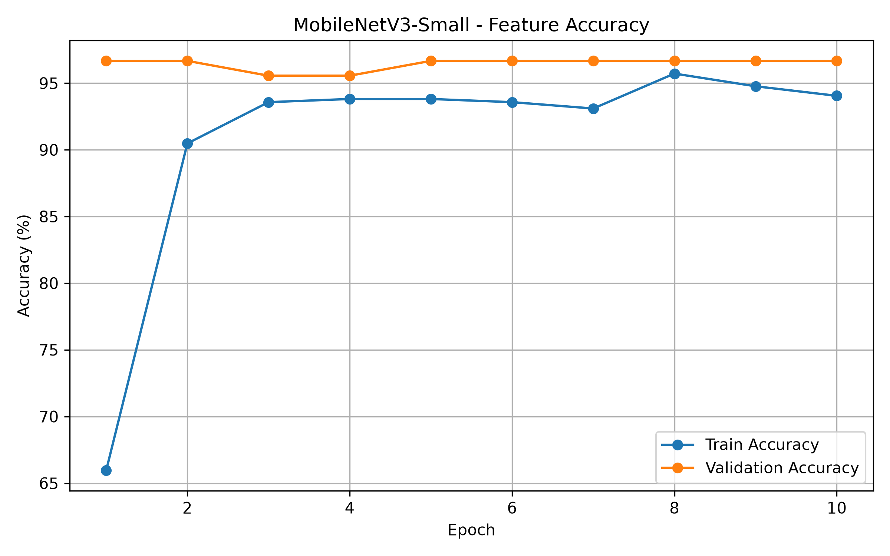
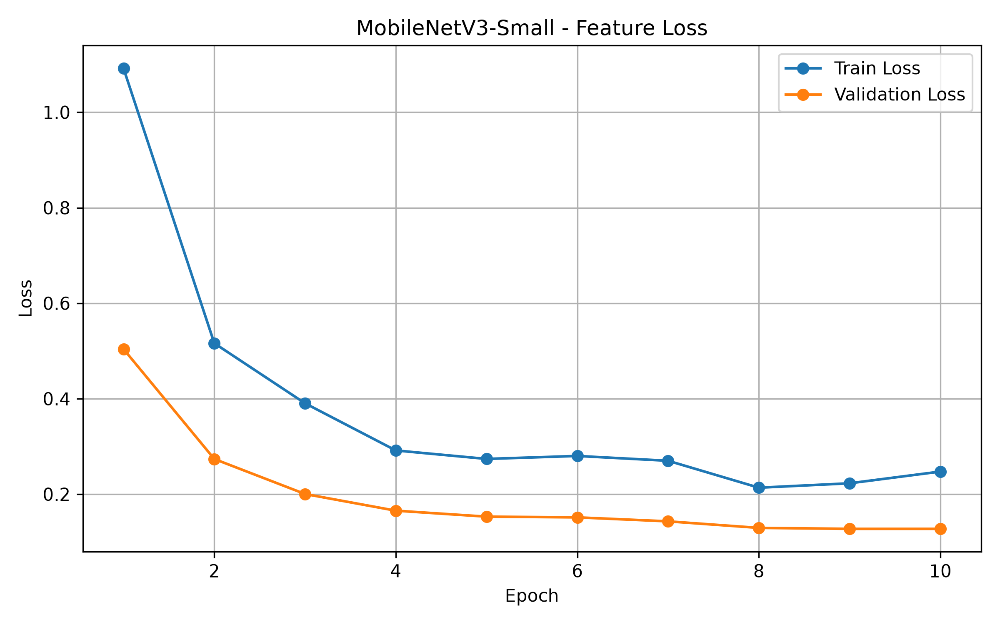
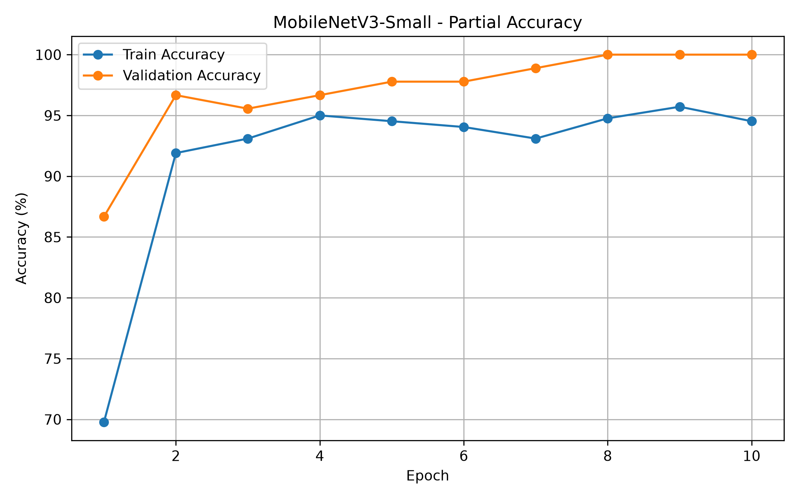
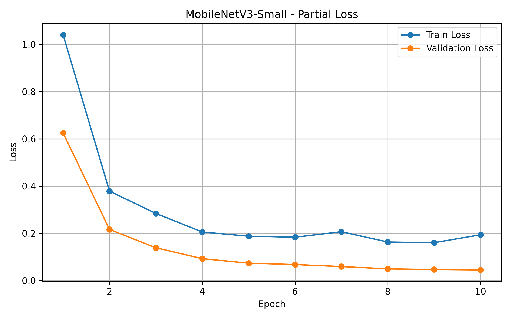
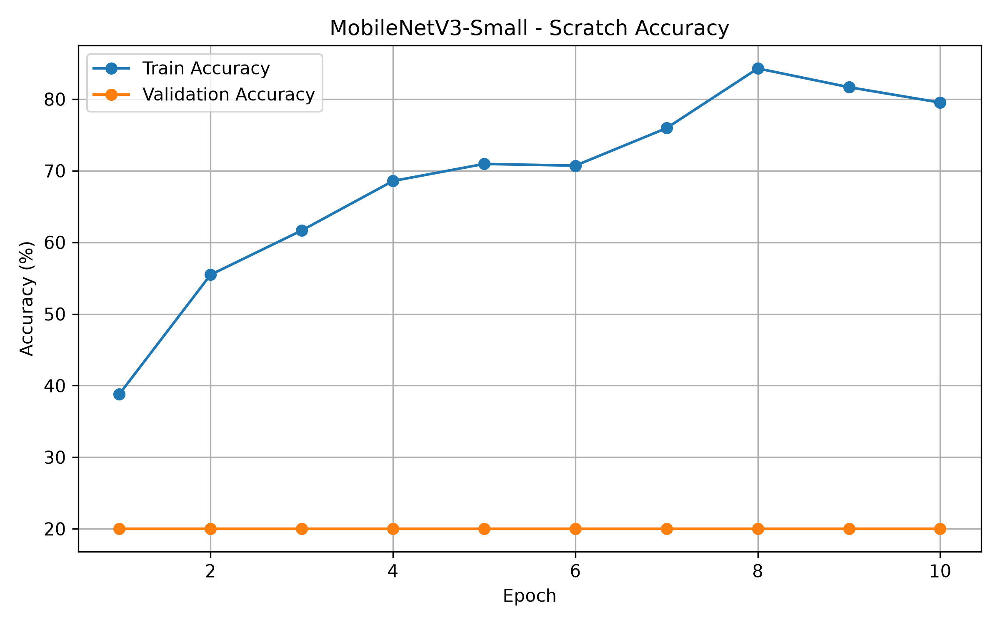
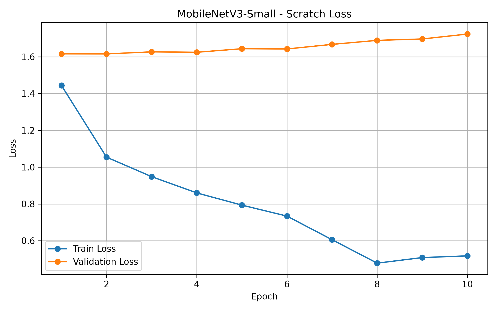
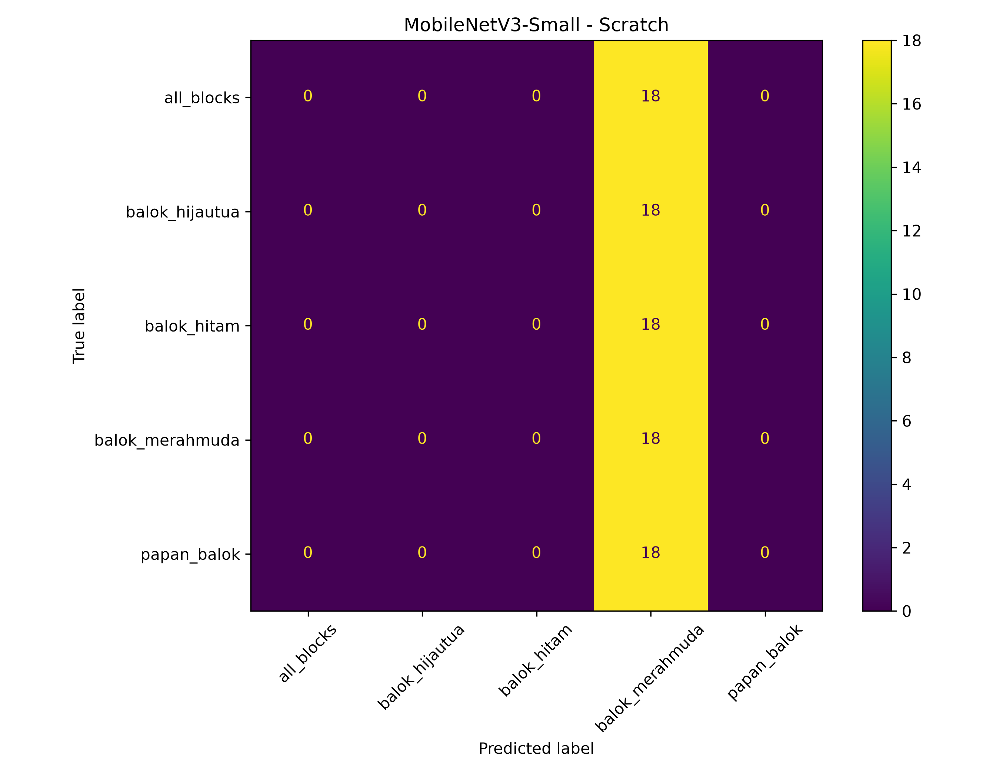

# MobileNetV3-Small Transfer Learning

**Fairus - 4222401043**  
**Cluster 4 - Guide Arm Robot**

## 👋 Perkenalan

Repository ini merupakan hasil tugas individu Transfer Learning pada mata kuliah Computer Vision and Deep Learning.

Model yang digunakan adalah **MobileNetV3-Small** untuk melakukan klasifikasi objek pada area kerja robot UR3 sebagai tahap awal sistem pick and place.

## 📌 Deskripsi Singkat

MobileNetV3-Small diuji menggunakan tiga mode pelatihan:

- Feature Extraction
- Fine-Tuning Partial
- Training from Scratch

Tujuan eksperimen adalah melihat pengaruh penggunaan pretrained ImageNet dan jumlah layer yang dilatih terhadap akurasi, loss, waktu training, dan kecepatan inferensi.

---

## 📊 Dataset

Dataset terdiri dari **600 citra** dengan 5 kelas:

| Kelas | Jumlah |
|---|---:|
| `all_blocks` | 120 |
| `balok_hijautua` | 120 |
| `balok_hitam` | 120 |
| `balok_merahmuda` | 120 |
| `papan_balok` | 120 |
| **Total** | **600** |

Pembagian dataset:

| Split | Jumlah |
|---|---:|
| Training | 420 |
| Validation | 90 |
| Testing | 90 |

---

## 🧠 Metodologi

- **Model:** MobileNetV3-Small
- **Input:** 224 × 224 pixel
- **Batch Size:** 16
- **Epoch:** 10
- **Optimizer:** Adam
- **Scheduler:** CosineAnnealingLR
- **Pretrained:** ImageNet
- **Device:** CPU

### Tiga Mode Eksperimen

| Mode | Bobot Awal | Layer yang Dilatih | Learning Rate |
|---|---|---|---:|
| Feature Extraction | ImageNet | Classifier | 1e-3 |
| Fine-Tuning Partial | ImageNet | 3 blok feature terakhir + classifier | 1e-4 / 1e-3 |
| Scratch | Random | Seluruh model | 1e-3 |

---

## 📈 Hasil Eksperimen

| Mode | Best Val Acc | Val Loss | Best Epoch | Epoch ≥90% | Training Time | Test Acc |
|---|---:|---:|---:|---:|---:|---:|
| Feature Extraction | 96.67% | 0.1274 | 9 | 1 | 58.93 s | 96.67% |
| Fine-Tuning Partial | **100.00%** | **0.0452** | 10 | 2 | **50.91 s** | **97.78%** |
| Scratch | 20.00% | 1.6155 | 2 | Tidak tercapai | 91.73 s | 20.00% |

### Evaluasi Test

| Mode | Precision | Recall | F1-Score | Mean Latency | Approx FPS |
|---|---:|---:|---:|---:|---:|
| Feature Extraction | 96.95% | 96.67% | 96.66% | 8.089 ms | 123.63 |
| Fine-Tuning Partial | **98.00%** | **97.78%** | **97.77%** | **7.598 ms** | **131.62** |
| Scratch | 4.00% | 20.00% | 6.67% | 7.807 ms | 128.10 |

---

## 📉 Grafik Training

### Feature Extraction - Accuracy



### Feature Extraction - Loss



### Fine-Tuning Partial - Accuracy



### Fine-Tuning Partial - Loss



### Scratch - Accuracy



### Scratch - Loss



### Perbandingan Validation Accuracy 3 Mode


### Perbandingan Validation Loss 3 Mode


---

## 🏆 Mode Terbaik

Mode terbaik adalah **Fine-Tuning Partial** dengan hasil:

| Parameter | Hasil |
|---|---:|
| Best Validation Accuracy | 100.00% |
| Best Validation Loss | 0.0452 |
| Best Epoch | 10 |
| Test Accuracy | 97.78% |
| Precision | 98.00% |
| Recall | 97.78% |
| F1-Score | 97.77% |
| Mean Latency | 7.598 ms/image |
| Approx FPS | 131.62 FPS |

Fine-Tuning Partial memberikan hasil terbaik karena model tetap memanfaatkan fitur hasil pretraining ImageNet, tetapi tiga blok feature terakhir dapat menyesuaikan diri dengan karakteristik dataset target.

---

## 🔬 Confusion Matrix

### Feature Extraction


### Fine-Tuning Partial


### Scratch



---

## 🔎 Analisis Singkat

**Feature Extraction** sudah memberikan performa tinggi dengan test accuracy 96.67% walaupun hanya classifier yang dilatih.

**Fine-Tuning Partial** meningkatkan test accuracy menjadi 97.78% dan menghasilkan validation loss paling rendah, sehingga menjadi konfigurasi terbaik pada eksperimen ini.

**Training from Scratch** hanya memperoleh test accuracy 20%. Dengan lima kelas yang seimbang, hasil tersebut menunjukkan bahwa model yang dilatih dari awal belum mampu melakukan generalisasi dengan baik menggunakan jumlah data dan epoch yang tersedia.

---

## 📦 Struktur Repository

```text
.
├── dataset_raw/
│   ├── all_blocks/
│   ├── balok_hijautua/
│   ├── balok_hitam/
│   ├── balok_merahmuda/
│   └── papan_balok/
│
├── dataset/
│   ├── train/
│   ├── val/
│   └── test/
│
├── models/
│   ├── best_mobilenetv3_small_feature.pth
│   ├── best_mobilenetv3_small_partial.pth
│   └── best_mobilenetv3_small_scratch.pth
│
├── results/
│   │
│   ├── history/
│   │   ├── history_mobilenetv3_small_feature.csv
│   │   ├── history_mobilenetv3_small_partial.csv
│   │   └── history_mobilenetv3_small_scratch.csv
│   │
│   ├── plots/
│   │   ├── accuracy_mobilenetv3_small.png
│   │   ├── accuracy_mobilenetv3_small_feature.png
│   │   ├── accuracy_mobilenetv3_small_partial.png
│   │   ├── accuracy_mobilenetv3_small_scratch.png
│   │   ├── comparison_accuracy_3_modes_mobilenetv3_small.png
│   │   ├── comparison_loss_3_modes_mobilenetv3_small.png
│   │   ├── loss_mobilenetv3_small.png
│   │   ├── loss_mobilenetv3_small_feature.png
│   │   ├── loss_mobilenetv3_small_partial.png
│   │   └── loss_mobilenetv3_small_scratch.png
│   │
│   └── evaluation/
│       ├── hasil_3_mode_mobilenetv3_small.csv
│       ├── confusion_matrix_mobilenetv3_small_feature.png
│       ├── confusion_matrix_mobilenetv3_small_partial.png
│       └── confusion_matrix_mobilenetv3_small_scratch.png
│
├── train_mobilenet.py
├── train_mobilenet_3_modes.py
├── evaluate_mobilenet.py
├── requirements.txt
├── .gitignore
├── .gitattributes
└── README.md
```

---

## ✅ Kesimpulan

Eksperimen menunjukkan bahwa strategi pelatihan memberikan pengaruh besar terhadap performa MobileNetV3-Small.

**Fine-Tuning Partial** menghasilkan performa terbaik dengan test accuracy **97.78%** dan F1-score **97.77%**. Feature Extraction juga menghasilkan performa tinggi sebesar **96.67%**, sedangkan Training from Scratch hanya mencapai **20%**.

Hasil tersebut menunjukkan bahwa pemanfaatan pretrained ImageNet lebih efektif untuk dataset project yang relatif kecil dibandingkan melatih MobileNetV3-Small dari awal.